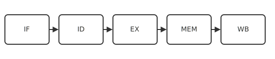

# CPU

Processor datapath, control, registers, and execution units.

<!-- generated by tools/build_common.py; do not edit by hand -->

| Preview | Title | Institution | Language | License |
|---|---|---|---|---|
|  | datapath-overview | Aurora Ridge University | - | CC-BY-SA-4.0 |
