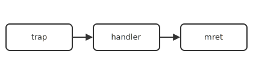

# Interrupts and exceptions

Exceptions, interrupts, and trap handling.

<!-- generated by _tools/build_common.py; do not edit by hand -->

| Preview | Title | Institution | Language | License |
|---|---|---|---|---|
|  | Trap entry and return | Example University (Aurora Ridge) | - | MIT |
