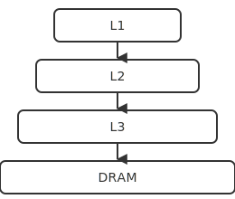

# Memory

Memory hierarchy, caches, and addressing.

<!-- generated by _tools/build_common.py; do not edit by hand -->

| Preview | Title | Institution | Language | License |
|---|---|---|---|---|
|  | Memory hierarchy, L1 through DRAM | Example University (Aurora Ridge) | - | CC-BY-4.0 |
