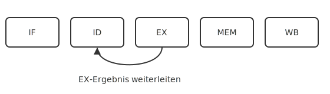
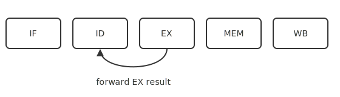

# Pipelining

Instruction pipelining, hazards, and forwarding.

<!-- generated by _tools/build_common.py; do not edit by hand -->

| Preview | Title | Institution | Language | License |
|---|---|---|---|---|
|  | hazard-forwarding_de | Example University (Aurora Ridge) | de | MIT |
|  | hazard-forwarding_en | Example University (Aurora Ridge) | en | MIT |
