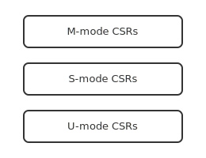

# Privileged architecture

RISC-V privileged spec, modes, and CSRs.

<!-- generated by _tools/build_common.py; do not edit by hand -->

| Preview | Title | Institution | Language | License |
|---|---|---|---|---|
|  | csr-layout | Example University (Aurora Ridge) | - | MIT |
