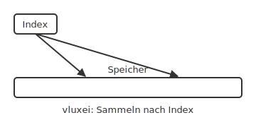
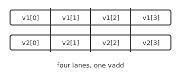

# Vector extension

RISC-V vector (RVV) extension.

<!-- generated by _tools/build_common.py; do not edit by hand -->

| Preview | Title | Institution | Language | License |
|---|---|---|---|---|
|  | Vektor-Gather nach Index | Example University (Aurora Ridge) | de | MIT |
|  | RVV vector lanes | Example University (Aurora Ridge) | - | MIT |
